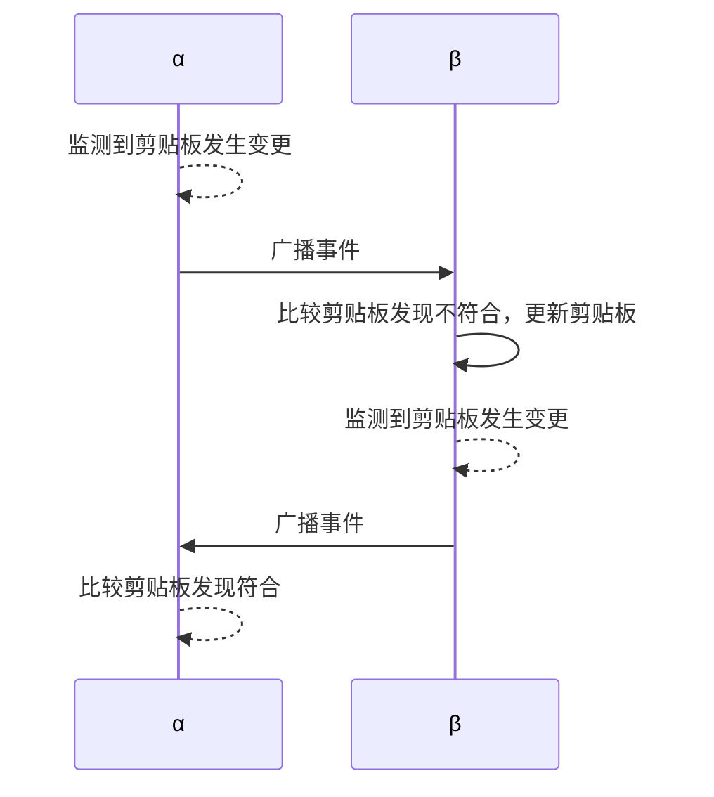
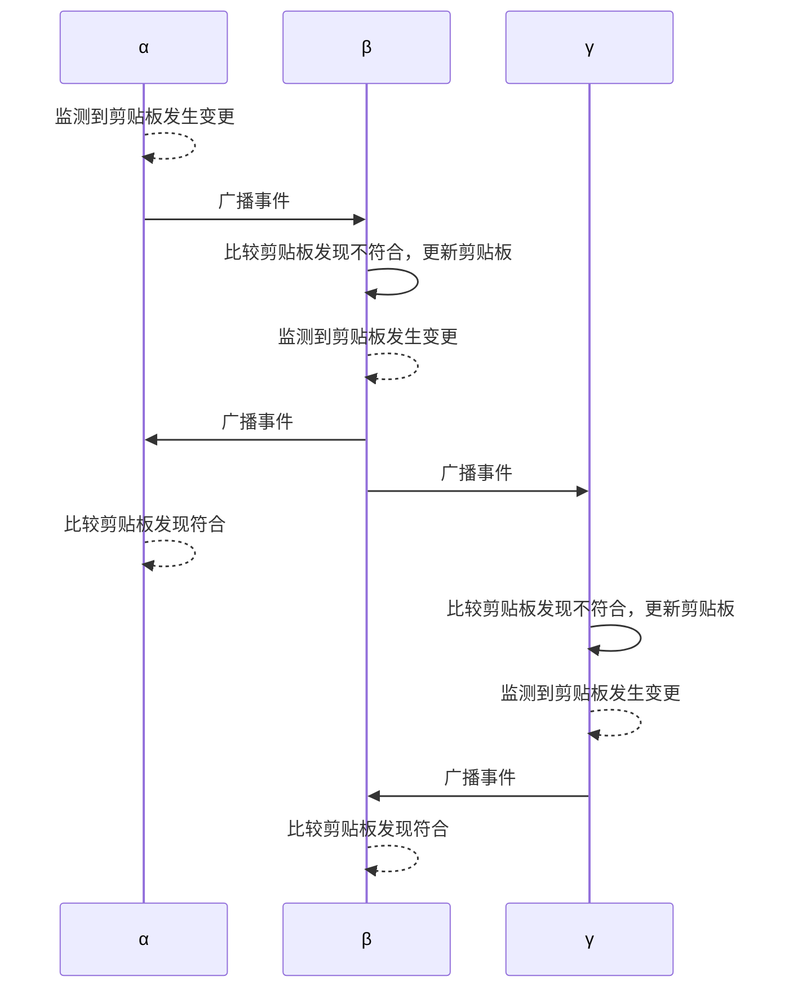

# PeerClip

## 关于

这是一个剪贴板管理小工具，带有 p2p 发现与同步和简易的历史管理功能。为确保正常使用，请允许应用通过防火墙（如果系统出现提示的话）。

有什么新的想法或是改进思路欢迎随时开启 issue / PR 。

## 开始使用

> 程序仍然处于早期开发阶段，相关内容可能会出现破坏性改动，请注意不同版本间的兼容性问题。

基础功能

程序的使用非常简单，运行可执行文件即可打开程序窗口。 初次运行时系统可能会提示您需要确认防火墙选项，如果您需要使用 P2P 同步功能，请允许应用通过防火墙。

出于方便使用的目的，程序默认为锁定在最前；如果您暂时不需要使用相关的功能，但又想继续监听剪贴板变动，您可以最小化程序窗口。

程序的主体部分是剪贴板区域，底部为状态与控制栏，从左到右分别为 **条目计数** **全部删除** **Peers 计数** ，对应含义分别如下：

- 条目计数：统计当前软件内共记录了多少个条目。
- 全部删除：一个需要 **长按** 的按钮，按下按钮可以清空除当前条目和受保护条目外的所有内容。
- Peers 计数：用于在 P2P 通讯中使用，统计当前共与多少个节点建立了连接。

程序会自动监听剪贴板，当您复制文本时，程序界面的最顶端会出现新的条目，此为新增条目时的操作。被蓝色外框选中的条目为当前的活跃条目（即当前剪贴板里的内容），
其他条目仅存储在程序中，与剪贴板内容无关。

当有多个条目存在时，您可以自由拖动它们以进行重新排序。

单击某个条目可以将其设置为当前活跃条目，此操作会覆盖剪贴板里的内容。

如果复制已经存在的条目，则不会重新添加，而是会激活它并将它尽可能地滚动到程序界面的中央位置。

**右键** 某个条目可以展开针对单个条目的菜单，菜单当前共有两个功能：**保护** 和 **删除**。对应含义分别如下：
- 保护：将条目设置为保护状态，避免在使用 全部删除按钮 时删除。
- 删除：一个需要 **长按** 的按钮，删除单个条目。

P2P 通讯

程序使用 libp2p 作为 p2p 的资源库，会尝试使用 mDNS 机制自动发现本地网络中的其他节点，并与之建立通讯。

#### 机制

程序使用简单的事件触发逻辑，仅适合在低频变动操作（变动操作的时间远大于网络完全同步的时间）的场合；在含有高频操作的场合，为确保消息不重复、不遗漏，您需要修改本程序的广播机制以避免出现数据不一致的情况。

当前通讯的内容仅为 *广播剪贴板的变更* 事件，不包含的其他操作（保护、删除）。逻辑如下：
1. 当本地剪贴板发生变更时，会将其广播至所有的 peers 节点；
2. 接收到来自其他 peers 节点的事件时，会比较本地的剪贴板内容，如果与本地内容不符则将其应用到本地剪贴板中；

通过比较剪贴板内容，可以避免因直接设置剪贴板内容导致可能的事件无限循环。

#### 流程举例

一个简易的流程举例如下：假设存在 α β 两个已建立连接的节点：

扩展网络，假设并非所有节点都完整互联，例如存在 α β γ 三个节点，其中 α 与 β 建立连接， β 与 γ 建立连接， α 与 γ 之间没有直接连接：

这样的逻辑以重复分发为代价，能将消息以一种简单的方式完全地、不遗漏地广播至所有相关的节点。

## 待办

- 支持更多数据类型（图片、文件等等）
- 剪贴板更新时，闪烁任务栏图标以引起用户注意（需要等待 Wails V3 的 `window.Flash()` 功能）

## 技术栈

- P2P 发现与通讯： libp2p
- 应用打包构建： Wails
- 前端开发： React 与 TailwindCSS

&copy; 2025 Nya Candy 版权所有
